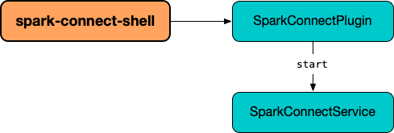

# Spark Connect Shell

**Spark Connect Shell** can be started using `bin/spark-connect-shell` shell script.

`spark-connect-shell` runs a `spark-shell` with Spark Connect enabled.

`spark-connect-shell` uses `--conf spark.plugins` ([Spark Core]({{ book.spark_core }}/configuration-properties/#spark.plugins)) configuration property with [SparkConnectPlugin](server/SparkConnectPlugin.md).

<figure markdown>
  
</figure>
